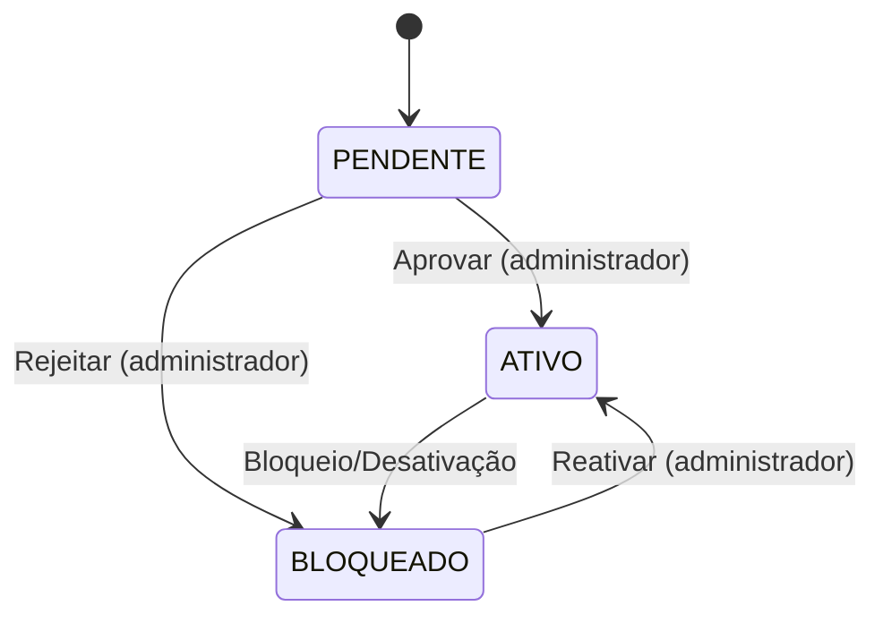

# 02 - Fluxos e Telas

## Fluxo principal de login (MVP)
```mermaid
flowchart TD
    A[Aplicação inicia] --> B[Tela Login]
    B --> C{Usuário preenche\nE-mail e Senha}
    C --> D[Validar formato e campos]
    D -->|Inválido| E[Exibir erro claro]
    D -->|Válido| F[AuthService.Autenticar]
    F --> G{Senha correta?}
    G -->|Não| H[Incrementar falhas\n+ verificar bloqueio]
    H -->|Bloqueio| I[Exibir bloqueio\n(tempo restante)]
    H -->|Sem bloqueio| E
    G -->|Sim| J{Usuário ATIVO?}
    J -->|Não| K[Exibir aviso\n"Aguardando aprovação"]
    J -->|Sim| L[Login OK\nAbrir tela inicial (MVP)]
```

## Estados do usuário


## Tela de Login
**Elementos**:
- Fundo com imagem e logo (placeholders em `assets/`).
- Campos: **E-mail** e **Senha**.
- Checkbox: “**Lembrar meu e-mail**”.
- Botão: “**Entrar**”.
- Link/Botão: “**Criar conta**”.
- Link/Botão: “**Entrar como Administrador**”.

**Comportamentos**:
- Validar formato de e-mail e senha com tamanho entre **8 e 256 caracteres**.
- Em erro: mensagem clara e genérica, sem revelar se o e-mail existe.
- Em bloqueio: exibir tempo restante e impedir novas tentativas.

## Tela Cadastro
**Campos obrigatórios**:
- Empresa, Nome, CPF, Cargo, E-mail, Senha.
**Limites de tamanho**:
- Empresa/Nome: até 200 caracteres.
- Cargo: até 120 caracteres.
- E-mail: até 254 caracteres.
- CPF: até 14 caracteres (com pontuação).
- Senha: 8 a 256 caracteres.

**Fluxo**:
- Validar CPF e e-mail.
- Registrar usuário como **PENDENTE**.
- Exibir mensagem de sucesso: “Cadastro enviado para aprovação”.

## Tela Administrador - Aprovações
**Lista de pendências**:
- Exibir usuários com status **PENDENTE**.
- Ações: **Aprovar** / **Rejeitar** (com motivo).
- Ao aprovar: status **ATIVO**.
- Ao rejeitar: status **BLOQUEADO** (MVP) + motivo.
- Ação extra: **Promover a Admin** (define `Role=Admin` e `Status=ATIVO`).

## Mensagens de erro (padrão)
- “E-mail ou senha inválidos.”
- “Sua conta está pendente de aprovação.”
- “Conta bloqueada temporariamente. Tente novamente em X segundos.”
- “Você não tem permissão para acessar o modo administrador.”
