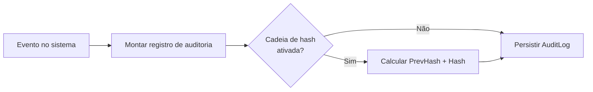

# 04 - Segurança e Auditoria

## Diretrizes de segurança
- **Senha**: nunca armazenar em texto; usar **PBKDF2 + salt**.
- **Parâmetros PBKDF2**: definir iterações com base na performance do PC alvo (ex.: 100.000) e registrar o valor em `IteracoesPBKDF2`.
- **Lockout**: após 5 falhas consecutivas, bloquear por 30 s (configurável).
- **Erros de autenticação**: mensagem única, sem revelar se o e-mail existe.
- **Dados sensíveis**: não registrar senha, CPF completo ou dados internos em logs.
- **Armazenamento local**: banco de dados no diretório de dados do usuário  
  - Windows: `%AppData%\Protons`  
  - Linux: `XDG_DATA_HOME/Protons` (fallback `~/.local/share/Protons`)
- **Senha (anti-DoS)**: limitar tamanho máximo (ex.: 256 caracteres) para evitar travas no PBKDF2.

## Auditoria (AuditLog)
Eventos obrigatórios:
- `LOGIN_SUCESSO`
- `LOGIN_FALHA`
- `CRIAR_CONTA`
- `APROVAR_USUARIO`
- `REJEITAR_USUARIO`
- `PROMOVER_ADMIN`
- `LOCKOUT`
- `LOGOUT`

Campos mínimos do log de auditoria:
- `timestamp`
- `userId`/`email`
- `acao`
- `resultado` (OK/ERRO)
- `detalhes` (sem dados sensíveis)
- `maquina` (hostname)
- `versaoApp`

## Diagrama de auditoria

## Cadeia de hash (opcional)
Objetivo: detectar adulteração do histórico local.
- `PrevHash`: hash do registro anterior.
- `Hash`: hash do conteúdo atual + `PrevHash`.
- Se um log for alterado, a cadeia quebra.

**Vantagens**:
- Aumenta confiança na auditoria local.
- Detecta edição manual da base.

**Limitações**:
- Não evita exclusão de registros.
- Sem ancoragem externa (offline), a confiança é local.

## Recomendação de implementação
- Normalizar mensagens de log (ex.: “Usuário aprovado pelo administrador X”).
- Registrar a versão do aplicativo para rastrear mudanças de comportamento.
- Registrar `hostname` para rastrear a máquina usada no evento.
