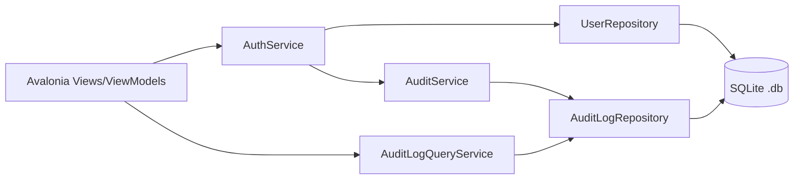

# 05 - Arquitetura do Código

## Padrão e camadas
**Padrão**: MVVM no Avalonia UI.

**Camadas**:
- **UI (Views/ViewModels)**: telas, validações visuais, vinculação (binding).
- **Core (Domain/Services)**: AuthService, AuditService, validações, regras.
- **Infraestrutura (Repositories)**: acesso ao SQLite e persistência.

Regra principal: **UI nunca acessa o banco diretamente**.

## Diagrama de componentes

## Estrutura sugerida de projetos
- `Protons.UI` — Avalonia UI, ViewModels, recursos de UI.
- `Protons.Core` — entidades, serviços, validações.
- `Protons.Infrastructure` — repositórios e SQLite.

## Serviços principais
- **AuthService**
  - `Autenticar(email, senha)`
  - `CriarConta(dto)`
  - `AprovarUsuario(id, adminId, motivo)`
  - `RejeitarUsuario(id, adminId, motivo)`
  - `PromoverUsuarioAdmin(id, adminId, motivo)`

- **AuditService**
  - `Registrar(entry, usarHashChain)`
  - Opção de cadeia de hash (`HashChain`).
- **AuditLogQueryService**
  - `GetPage(page, pageSize)` para paginação de logs.

## Configurações locais
- **Dados do app**:
  - Windows: `%AppData%\Protons`
  - Linux: `XDG_DATA_HOME/Protons` (fallback `~/.local/share/Protons`)
- **Arquivos**: `Protons.db` e `settings.json`.
- **settings.json**: guardar apenas `ultimoEmail` e preferências visuais.
- **Logs operacionais**: `log_ops.jsonl` no diretório de dados do app.

## Considerações de performance
- Uso de **paginação/virtualização** em listas de auditoria.
- Carregamento sob demanda de logs para evitar travamento em HDD.
- Evitar imagens de fundo pesadas (compressão).
