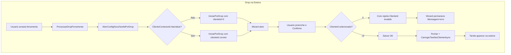

# Plano: Drop de Tarefa na Esteira — Robusto e Enterprise

## Diagnóstico

O fluxo atual tem falhas que explicam "não consigo finalizar" e "não entra no local correto":

**Problemas identificados:**

1. **P0 — Cliente não selecionado**: `ClienteContextoId ?? 0` permite abrir o wizard com `clienteId=0`. O usuário preenche tudo e só na confirmação recebe "ClienteId inválido".
2. **P1 — Sem validação antes do drop**: O drop é aceito mesmo sem cliente. O ideal é bloquear antes de abrir o wizard.
3. **P2 — Isolamento por cliente**: O filtro `TarefaFiltroConsulta.ClienteId == ClienteContextoId` garante que só carregamos tarefas do cliente. O risco está em criar tarefa com `ClienteId` errado (ex.: 0 ou de outro cliente).
4. **P3 — Posição na esteira**: O `EsteiraId` vem do payload do drop. Se a esteira não existir ou o ID estiver inconsistente, `EncontrarOuCriarEsteira` cria uma nova. O mapeamento depende de `_estadoEsteirasPorCliente` estar alinhado com o cliente selecionado.

---

## Arquivos principais

| Arquivo                                                                                                                                                                               | Responsabilidade                                                           |
| ------------------------------------------------------------------------------------------------------------------------------------------------------------------------------------- | -------------------------------------------------------------------------- |
| [PainelViewModel.ReguaTempo.cs](painel principal/codigos/painel_principal/funcionalidades/painel/modelos_de_visao/funcoes/PainelViewModel.ReguaTempo.cs)                              | `AbrirModalAncorarPdfPorFerramenta` — passa `ClienteContextoId ?? 0`       |
| [AncorarPdfAgendamentoBasicoViewModel.cs](painel principal/codigos/painel_principal/funcionalidades/ferramentas/ancorar_pdf/modelos_de_visao/AncorarPdfAgendamentoBasicoViewModel.cs) | `IniciarPorDrop`, `ConfirmarAgendamentoAsync`                              |
| [EsteiraTarefasControl.cs](painel principal/codigos/painel_principal/funcionalidades/painel/interface/controles/EsteiraTarefasControl.cs)                                             | `OnDrop`, `ProcessarDropFerramenta`, `FerramentaSoltaNaEsteira`            |
| [PainelReguaTempoView.axaml.cs](painel principal/codigos/painel_principal/funcionalidades/painel/interface/funcionalidades/tarefas_realizadas/PainelReguaTempoView.axaml.cs)          | Conecta `FerramentaSoltaNaEsteira` → `AbrirConfigNovaTarefaPorDropCommand` |

---

## Mudanças propostas

### 1. Bloquear drop sem cliente selecionado (P0)

**Onde:** `PainelViewModel.ReguaTempo.cs` — `AbrirModalAncorarPdfPorFerramenta` (linha ~498)

**O que fazer:**

- Antes de `AncorarPdfAgendamentoBasico.IniciarPorDrop`, checar `ClienteContextoId.HasValue && ClienteContextoId.Value > 0`.
- Se não houver cliente: exibir mensagem e não abrir o wizard.
- Opções de UX:
  - **A)** Toast/notificação: "Selecione um cliente antes de soltar a ferramenta na esteira."
  - **B)** Usar `MensagemTarefasCliente` ou outro canal de feedback do painel.
  - **C)** Abrir o seletor de cliente em primeiro plano.

**Recomendação:** A (toast) ou B (mensagem no painel).

### 2. Validação no wizard (P1)

**Onde:** `AncorarPdfAgendamentoBasicoViewModel.cs` — `IniciarPorDrop` (linha ~154)

**O que fazer:**

- Se `clienteId <= 0`, não abrir o wizard: definir `Mensagem = "Cliente não selecionado. Selecione um cliente no topo do painel antes de criar uma tarefa."` e `EstaAtivo = false`.
- Isso serve como fallback caso o bloqueio em (1) falhe.

### 3. Garantir ClienteId selecionado antes de salvar (P2)

**Onde:** `AncorarPdfAgendamentoBasicoViewModel.cs` — `ConfirmarAgendamentoAsync` (linha ~357)

**O que fazer:**

- Antes de `_service.CriarOuAtualizar`, validar `_clienteId > 0` (cliente selecionado no painel).
- Se inválido: `Mensagem = "Cliente não selecionado. Feche e selecione um cliente no topo do painel."` e retornar sem chamar o serviço.
- **Não validar documento/PDF aqui** — na hora de salvar o doc pode ainda não estar na pasta. A validação de documento ocorre na execução da tarefa.

### 4. Consistência EsteiraId vs Cliente (P3)

**Onde:** `PainelViewModel.ReguaTempo.cs` — `AbrirModalAncorarPdfPorFerramenta`

**O que fazer:**

- Garantir que o `EsteiraId` do payload vem de uma esteira do cliente atual.
- Verificar se `payload.EsteiraId` existe em `Esteiras` e pertence ao cliente em contexto.
- Se a esteira não existir ou não pertencer ao cliente: usar a primeira esteira disponível ou recusar o drop com mensagem clara.

### 5. Reforçar o reload após salvar (P4)

**Onde:** `PainelViewModel.cs` — callback `fecharWizard` (linha ~274)

**O que fazer:**

- Antes de `CarregarTarefasClienteAsync`, verificar `ClienteContextoId.HasValue`.
- Se não houver cliente: não chamar reload (evitar erro ou comportamento estranho).

### 6. Feedback de erro no wizard (P5)

**Onde:** `AncorarPdfAgendamentoBasicoViewModel.cs` — `ConfirmarAgendamentoAsync` (catch)

**O que fazer:**

- Melhorar a mensagem de erro para o usuário: "Erro ao salvar: {ex.Message}".
- Se o erro for de validação do Core (ex.: "ClienteId inválido"), incluir orientação: "Verifique se um cliente está selecionado no painel."

---

## Resumo de alterações

| #   | Arquivo                                   | Alteração                                                                                  |
| --- | ----------------------------------------- | ------------------------------------------------------------------------------------------ |
| 1   | `PainelViewModel.ReguaTempo.cs`           | Bloquear abertura do wizard quando `!ClienteContextoId.HasValue                            |
| 2   | `AncorarPdfAgendamentoBasicoViewModel.cs` | Em `IniciarPorDrop`, se `clienteId <= 0`, não abrir e definir mensagem                     |
| 3   | `AncorarPdfAgendamentoBasicoViewModel.cs` | Em `ConfirmarAgendamentoAsync`, validar `_clienteId > 0` antes de salvar                   |
| 4   | `PainelViewModel.ReguaTempo.cs`           | Validar `payload.EsteiraId` contra `Esteiras` do cliente                                   |
| 5   | `PainelViewModel.cs`                      | Em `fecharWizard`, só chamar `CarregarTarefasClienteAsync` se `ClienteContextoId.HasValue` |

---

## Isolamento por cliente

- **Carregamento:** `TarefaFiltroConsulta.ClienteId = ClienteContextoId.Value` garante só tarefas do cliente.
- **Criação:** `ClienteId` vem de `ClienteContextoId` (cliente selecionado no painel). Bloquear drop sem cliente evita `ClienteId = 0` e mistura entre clientes.
- **Validação de documento:** ocorre na execução da tarefa (ex.: 1h antes), não no salvamento. Na hora de salvar, o usuário pode ainda não ter colocado o PDF na pasta.
- **Esteiras:** `_estadoEsteirasPorCliente` mantém estado por cliente; ao trocar de cliente, `RestaurarEstadoEsteirasCliente` restaura o estado correto.

---

## Testes sugeridos

1. Drop sem cliente: wizard não deve abrir; mensagem de "Selecione um cliente" deve aparecer.
2. Drop com cliente: wizard abre; confirmação salva; tarefa aparece na esteira correta.
3. Trocar de cliente e dropar: tarefa deve ser criada para o cliente atual.
4. Regressão: fluxo existente com cliente selecionado continua funcionando.

